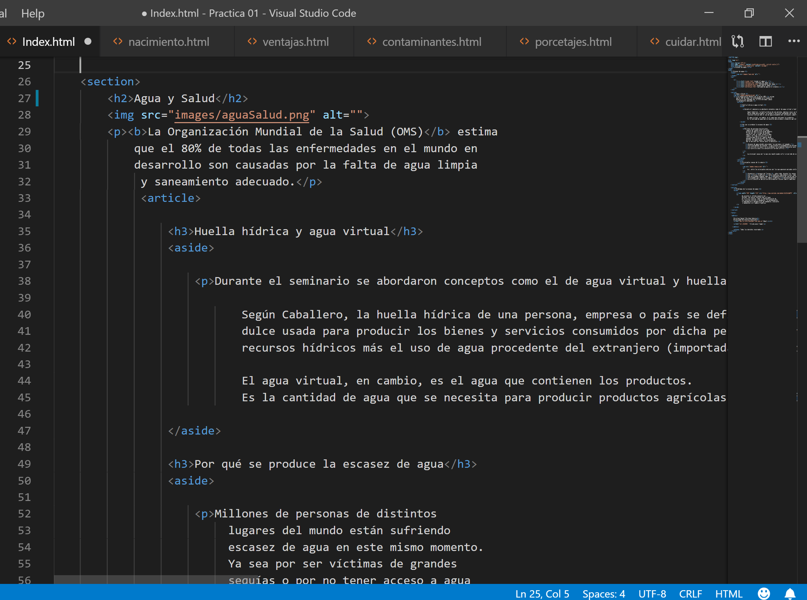

-   **En la pagina principal se insertan dos secciones con la etiqueta
    \<section\>.**

    Cada sección contiene una imagen con el elemento \, dos artículos
    \<article\>, párrafos los cuales se insertan con la etiqueta \<p\> y títulos
    que se insertan con las etiquetas \<h1\>, \<h2\> y \<h3\>.

    
